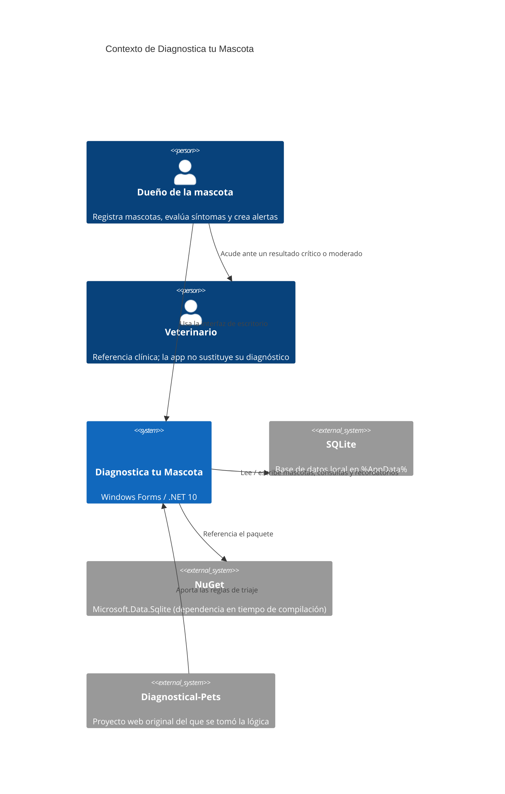
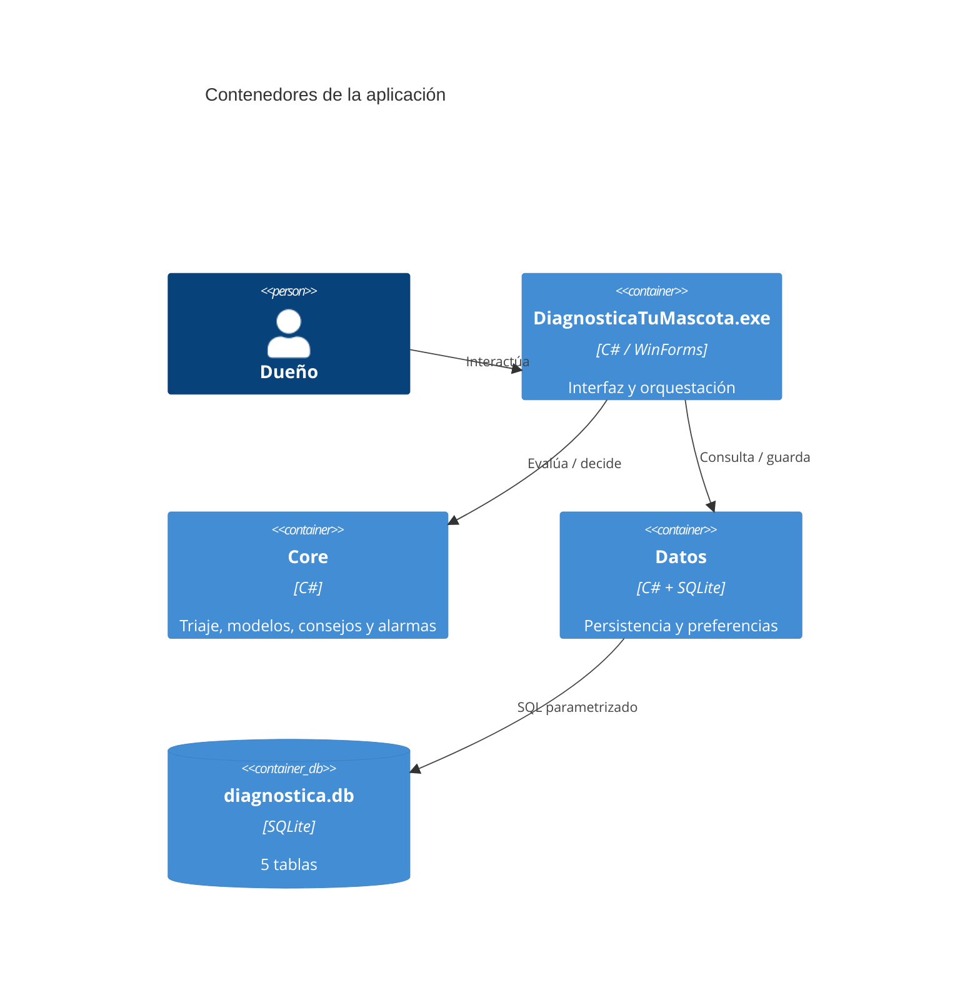

# Diagrama de contexto

Muestra los actores y sistemas que interactúan con la aplicación.

```mermaid
C4Context
    title Contexto de Diagnostica tu Mascota

    Person(dueño, "Dueño de la mascota", "Registra mascotas, evalúa síntomas y crea alertas")
    Person(vet, "Veterinario", "Referencia clínica; la app no sustituye su diagnóstico")

    System(app, "Diagnostica tu Mascota", "Windows Forms / .NET 10", "Triaje orientativo y gestión local")

    System_Ext(sqlite, "SQLite", "Base de datos local en %AppData%")
    System_Ext(nuget, "NuGet", "Microsoft.Data.Sqlite (dependencia en tiempo de compilación)")
    System_Ext(original, "Diagnostical-Pets", "Proyecto web original del que se tomó la lógica")

    Rel(dueño, app, "Usa la interfaz de escritorio")
    Rel(app, sqlite, "Lee / escribe mascotas, consultas y recordatorios")
    Rel(app, nuget, "Referencia el paquete")
    Rel(original, app, "Aporta las reglas de triaje")
    Rel(dueño, vet, "Acude ante un resultado crítico o moderado")
```

## Contenedores

```mermaid
C4Container
    title Contenedores de la aplicación

    Person(dueño, "Dueño")

    Container(exe, "DiagnosticaTuMascota.exe", "C# / WinForms", "Interfaz y orquestación")
    Container(core, "Core", "C#", "Triaje, modelos, consejos y alarmas")
    Container(datos, "Datos", "C# + SQLite", "Persistencia y preferencias")
    ContainerDb(db, "diagnostica.db", "SQLite", "5 tablas")

    Rel(dueño, exe, "Interactúa")
    Rel(exe, core, "Evalúa / decide")
    Rel(exe, datos, "Consulta / guarda")
    Rel(datos, db, "SQL parametrizado")
```

Volver al [índice de documentación](../INDICE.md#diagramas).
